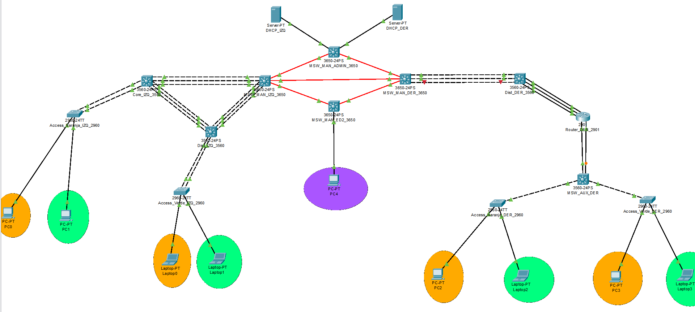

# Manual Técnico — Proyecto Chapin Red

**Carnet:** 201904490 | **Protocolo:** OSPF | **Plataforma:** Cisco Packet Tracer

---

## 1. Descripción del Proyecto

Chapin Red es una empresa de responsabilidad social que opera desde **cuatro edificios** distribuidos geográficamente. Este proyecto implementa una red corporativa multi-edificio completa con:

- Segmentación por VLANs (departamentos de Proyectos, Coordinación y Administración)
- Enrutamiento dinámico OSPF entre edificios
- Alta disponibilidad mediante EtherChannel (LACP y PAgP)
- Asignación dinámica de IPs vía DHCP con relay
- Control de acceso mediante ACLs

---

## 2. Topología de Red



### 2.1 Dispositivos de la Topología

| Dispositivo             | Modelo          | Cantidad | Función                           |
| ----------------------- | --------------- | -------- | --------------------------------- |
| MSW_MAN_IZQ_3650        | Cisco 3650-24PS | 1        | MAN Edificio Izquierdo            |
| MSW_MAN_DER_3650        | Cisco 3650-24PS | 1        | MAN Edificio Derecho              |
| MSW_MAN_ADMIN_3650      | Cisco 3650-24PS | 1        | MAN Edificio Admin (VTP Server)   |
| MSW_MAN_ED2_3650        | Cisco 3650-24PS | 1        | MAN Edificio 2 (PC4/Admin)        |
| Core_IZQ_3560           | Cisco 3560-24PS | 1        | Core — Edificio Izquierdo         |
| Dist_IZQ_3560           | Cisco 3560-24PS | 1        | Distribución — Edificio Izquierdo |
| Dist_DER_3560           | Cisco 3560-24PS | 1        | Distribución — Edificio Derecho   |
| MSW_AUX_DER             | Cisco 3560-24PS | 1        | Auxiliar — Edificio Derecho       |
| Access_Naranja_IZQ_2960 | Cisco 2960-24TT | 1        | Acceso VLAN 10/20 — Izquierdo     |
| Access_Verde_IZQ_2960   | Cisco 2960-24TT | 1        | Acceso VLAN 10/20 — Izquierdo     |
| Access_Naranja_DER_2960 | Cisco 2960-24TT | 1        | Acceso VLAN 30/40 — Derecho       |
| Access_Verde_DER_2960   | Cisco 2960-24TT | 1        | Acceso VLAN 30/40 — Derecho       |
| Router_DER_2901         | Cisco 2901      | 1        | Router inter-VLAN Derecho         |
| DHCP_IZQ                | Server-PT       | 1        | Servidor DHCP Izquierdo           |
| DHCP_DER                | Server-PT       | 1        | Servidor DHCP Derecho             |

### 2.2 Hosts Finales

| Host    | Tipo      | VLAN                  | Edificio   |
| ------- | --------- | --------------------- | ---------- |
| PC0     | PC-PT     | VLAN 10 (Naranja IZQ) | Izquierdo  |
| PC1     | PC-PT     | VLAN 20 (Verde IZQ)   | Izquierdo  |
| Laptop0 | Laptop-PT | VLAN 10 (Naranja IZQ) | Izquierdo  |
| Laptop1 | Laptop-PT | VLAN 20 (Verde IZQ)   | Izquierdo  |
| PC2     | PC-PT     | VLAN 30 (Naranja DER) | Derecho    |
| PC3     | PC-PT     | VLAN 30 (Naranja DER) | Derecho    |
| Laptop2 | Laptop-PT | VLAN 40 (Verde DER)   | Derecho    |
| Laptop3 | Laptop-PT | VLAN 40 (Verde DER)   | Derecho    |
| PC4     | PC-PT     | VLAN 99 (ADMIN)       | Edificio 2 |

### 2.3 Tabla de Conexiones Físicas

```
DHCP_IZQ(fa0)              → MSW_MAN_ADMIN_3650(gig1/0/1)   [access VLAN 99]
DHCP_DER(fa0)              → MSW_MAN_ADMIN_3650(gig1/0/2)   [access VLAN 99]
MSW_MAN_ADMIN_3650(gig1/1/1) → MSW_MAN_IZQ_3650(gig1/1/2)  [routed OSPF]
MSW_MAN_ADMIN_3650(gig1/1/2) → MSW_MAN_DER_3650(gig1/1/1)  [routed OSPF]
MSW_MAN_IZQ_3650(gig1/0/1-3)  → Core_IZQ_3560(fa0/3-5)    [LACP Po1]
MSW_MAN_IZQ_3650(gig1/0/4-6)  → Dist_IZQ_3560(fa0/6-8)    [LACP Po2]
MSW_MAN_IZQ_3650(gig1/1/1)  → MSW_MAN_ED2_3650(gig1/1/1)  [routed OSPF]
MSW_MAN_IZQ_3650(gig1/1/3)  → MSW_MAN_DER_3650(gig1/1/3)  [routed OSPF]
Core_IZQ_3560(fa0/6-8)     → Dist_IZQ_3560(fa0/3-5)        [LACP Po2]
Core_IZQ_3560(fa0/1-2)     → Access_Naranja_IZQ_2960(fa0/3-4) [LACP Po3]
Dist_IZQ_3560(fa0/1-2)     → Access_Verde_IZQ_2960(fa0/3-4)   [LACP Po3]
MSW_MAN_ED2_3650(gig1/0/1) → PC4(fa0)                      [access VLAN 99]
MSW_MAN_ED2_3650(gig1/1/2) → MSW_MAN_DER_3650(gig1/1/2)   [routed OSPF]
MSW_MAN_DER_3650(gig1/0/1-2) → Dist_DER_3560(gig0/1-2)    [PAgP Po1, mode on]
MSW_MAN_DER_3650(gig1/1/2)  → MSW_MAN_ED2_3650(gig1/1/2)  [routed OSPF]
Dist_DER_3560(fa0/4)       → Router_DER_2901(gig0/0)        [routed OSPF]
Dist_DER_3560(fa0/5)       → Router_DER_2901(gig0/1)        [routed OSPF]
Dist_DER_3560(fa0/6)       → Router_DER_2901(fa0/0/0)       [L2 trunk]
Router_DER_2901(fa0/0/1-2) → MSW_AUX_DER(fa0/1-2)          [PAgP Po1]
MSW_AUX_DER(fa0/3)         → Access_Naranja_DER_2960(fa0/1) [trunk]
MSW_AUX_DER(fa0/4)         → Access_Verde_DER_2960(fa0/1)   [trunk]
Access_Naranja_IZQ_2960(fa0/2) → PC0(fa0)                   [access VLAN 10]
Access_Naranja_IZQ_2960(fa0/1) → PC1(fa0)                   [access VLAN 20]
Access_Verde_IZQ_2960(fa0/1)   → Laptop0(fa0)               [access VLAN 10]
Access_Verde_IZQ_2960(fa0/2)   → Laptop1(fa0)               [access VLAN 20]
Access_Naranja_DER_2960(fa0/2) → Laptop2(fa0)               [access VLAN 40]
Access_Naranja_DER_2960(fa0/3) → PC2(fa0)                   [access VLAN 30]
Access_Verde_DER_2960(fa0/2)   → Laptop3(fa0)               [access VLAN 40]
Access_Verde_DER_2960(fa0/3)   → PC3(fa0)                   [access VLAN 30]
```

---

## 3. Direccionamiento IP (Fase 1 — Subnetting)

**Carnet:** 201904490 → **X = 90**

### 3.1 Red de VLANs — `192.188.90.0/24` (FLSM /27)

> 5 subredes → 3 bits prestados → **/27** | Máscara: `255.255.255.224` | 30 hosts usables

| VLAN   | Nombre                               | Red                 | Rango Usable  | Broadcast | Gateway (SVI)    |
| ------ | ------------------------------------ | ------------------- | ------------- | --------- | ---------------- |
| **10** | `VLAN_Naranja_EdificioIZQ_201904490` | `192.188.90.0/27`   | `.1 – .30`    | `.31`     | `192.188.90.1`   |
| **20** | `VLAN_Verde_EdificioIZQ_201904490`   | `192.188.90.32/27`  | `.33 – .62`   | `.63`     | `192.188.90.33`  |
| **30** | `VLAN_Naranja_EdificioDER_201904490` | `192.188.90.64/27`  | `.65 – .94`   | `.95`     | `192.188.90.65`  |
| **40** | `VLAN_Verde_EdificioDER_201904490`   | `192.188.90.96/27`  | `.97 – .126`  | `.127`    | `192.188.90.97`  |
| **99** | `VLAN_ADMIN_201904490`               | `192.188.90.128/27` | `.129 – .158` | `.159`    | `192.188.90.129` |

### 3.2 Red de Enlaces — `10.4.90.0/24` (VLSM /30)

> Máscara: `255.255.255.252` | 4 IPs por subred (2 usables) | Para enlaces punto a punto

| #   | Enlace              | Red             | IP Lado A        | IP Lado B        |
| --- | ------------------- | --------------- | ---------------- | ---------------- |
| L1  | MSW_ADMIN ↔ MSW_IZQ | `10.4.90.0/30`  | gig1/1/1 → `.1`  | gig1/1/2 → `.2`  |
| L2  | MSW_ADMIN ↔ MSW_DER | `10.4.90.4/30`  | gig1/1/2 → `.5`  | gig1/1/1 → `.6`  |
| L3  | MSW_IZQ ↔ MSW_ED2   | `10.4.90.8/30`  | gig1/1/1 → `.9`  | gig1/1/1 → `.10` |
| L4  | MSW_IZQ ↔ MSW_DER   | `10.4.90.12/30` | gig1/1/3 → `.13` | gig1/1/3 → `.14` |
| L5  | MSW_ED2 ↔ MSW_DER   | `10.4.90.16/30` | gig1/1/2 → `.17` | gig1/1/2 → `.18` |
| L6  | Dist_DER ↔ Router   | `10.4.90.20/30` | fa0/4 → `.21`    | gig0/0 → `.22`   |
| L7  | Dist_DER ↔ Router   | `10.4.90.24/30` | fa0/5 → `.25`    | gig0/1 → `.26`   |

### 3.3 IPs Estáticas de Infraestructura

| Dispositivo        | Interfaz | IP                  | Función                        |
| ------------------ | -------- | ------------------- | ------------------------------ |
| MSW_MAN_ADMIN_3650 | vlan 99  | `192.188.90.129/27` | Gateway VLAN 99 / DHCP servers |
| MSW_MAN_IZQ_3650   | vlan 10  | `192.188.90.1/27`   | Gateway VLAN 10                |
| MSW_MAN_IZQ_3650   | vlan 20  | `192.188.90.33/27`  | Gateway VLAN 20                |
| MSW_MAN_DER_3650   | vlan 30  | `192.188.90.65/27`  | Gateway VLAN 30                |
| MSW_MAN_DER_3650   | vlan 40  | `192.188.90.97/27`  | Gateway VLAN 40                |
| MSW_MAN_ED2_3650   | vlan 99  | `192.188.90.130/27` | Gateway VLAN 99 — PC4          |
| DHCP_IZQ           | fa0      | `192.188.90.131/27` | Servidor DHCP Izquierdo        |
| DHCP_DER           | fa0      | `192.188.90.132/27` | Servidor DHCP Derecho          |

---

## 4. Fase 3 — Configuración de VLANs y VTP

### 4.1 Parámetros VTP

| Parámetro      | Valor                    |
| -------------- | ------------------------ |
| Dominio VTP    | `CHAPINRED`              |
| Contraseña VTP | `redes2026`              |
| Versión VTP    | 2                        |
| VTP Server     | MSW_MAN_ADMIN_3650       |
| VTP Clients    | Todos los demás switches |

### 4.2 Comandos — MSW_MAN_ADMIN_3650 (VTP Server)

```cisco
enable
configure terminal
hostname MSW_MAN_ADMIN_3650

vtp mode server
vtp domain CHAPINRED
vtp password redes2026
vtp version 2

vlan 10
 name VLAN_Naranja_EdificioIZQ_201904490
vlan 20
 name VLAN_Verde_EdificioIZQ_201904490
vlan 30
 name VLAN_Naranja_EdificioDER_201904490
vlan 40
 name VLAN_Verde_EdificioDER_201904490
vlan 99
 name VLAN_ADMIN_201904490
exit

interface GigabitEthernet1/1/1
 no switchport
 ip address 10.4.90.1 255.255.255.252
 no shutdown

interface GigabitEthernet1/1/2
 no switchport
 ip address 10.4.90.5 255.255.255.252
 no shutdown

interface GigabitEthernet1/0/1
 switchport mode access
 switchport access vlan 99
 no shutdown

interface GigabitEthernet1/0/2
 switchport mode access
 switchport access vlan 99
 no shutdown

interface vlan 99
 ip address 192.188.90.129 255.255.255.224
 no shutdown

ip routing
end
write memory
```

### 4.3 Comandos — MSW_MAN_IZQ_3650 (VTP Client)

```cisco
enable
configure terminal
hostname MSW_MAN_IZQ_3650

vtp mode client
vtp domain CHAPINRED
vtp password redes2026

interface GigabitEthernet1/1/2
 no switchport
 ip address 10.4.90.2 255.255.255.252
 no shutdown

interface GigabitEthernet1/1/1
 no switchport
 ip address 10.4.90.9 255.255.255.252
 no shutdown

interface GigabitEthernet1/1/3
 no switchport
 ip address 10.4.90.13 255.255.255.252
 no shutdown

interface vlan 10
 ip address 192.188.90.1 255.255.255.224
 ip helper-address 192.188.90.131
 no shutdown

interface vlan 20
 ip address 192.188.90.33 255.255.255.224
 ip helper-address 192.188.90.131
 no shutdown

ip routing
end
write memory
```

### 4.4 Comandos — MSW_MAN_DER_3650 (VTP Client)

```cisco
enable
configure terminal
hostname MSW_MAN_DER_3650

vtp mode client
vtp domain CHAPINRED
vtp password redes2026

interface GigabitEthernet1/1/1
 no switchport
 ip address 10.4.90.6 255.255.255.252
 no shutdown

interface GigabitEthernet1/1/3
 no switchport
 ip address 10.4.90.14 255.255.255.252
 no shutdown

interface GigabitEthernet1/1/2
 no switchport
 ip address 10.4.90.18 255.255.255.252
 no shutdown

interface vlan 30
 ip address 192.188.90.65 255.255.255.224
 ip helper-address 192.188.90.132
 no shutdown

interface vlan 40
 ip address 192.188.90.97 255.255.255.224
 ip helper-address 192.188.90.132
 no shutdown

ip routing
end
write memory
```

### 4.5 Comandos — MSW_MAN_ED2_3650 (VTP Client)

```cisco
enable
configure terminal
hostname MSW_MAN_ED2_3650

vtp mode client
vtp domain CHAPINRED
vtp password redes2026

interface GigabitEthernet1/1/1
 no switchport
 ip address 10.4.90.10 255.255.255.252
 no shutdown

interface GigabitEthernet1/1/2
 no switchport
 ip address 10.4.90.17 255.255.255.252
 no shutdown

interface GigabitEthernet1/0/1
 switchport mode access
 switchport access vlan 99
 no shutdown

interface vlan 99
 ip address 192.188.90.130 255.255.255.224
 no shutdown

ip routing
end
write memory
```

### 4.6 Comandos — Switches de Acceso (2960)

```cisco
! Access_Naranja_IZQ_2960
vtp mode client
vtp domain CHAPINRED
vtp password redes2026

interface FastEthernet0/1
 switchport mode access
 switchport access vlan 20    ! PC1 — Verde IZQ

interface FastEthernet0/2
 switchport mode access
 switchport access vlan 10    ! PC0 — Naranja IZQ

! Access_Verde_IZQ_2960
interface FastEthernet0/1
 switchport mode access
 switchport access vlan 10    ! Laptop0 — Naranja IZQ

interface FastEthernet0/2
 switchport mode access
 switchport access vlan 20    ! Laptop1 — Verde IZQ

! Access_Naranja_DER_2960
interface FastEthernet0/2
 switchport mode access
 switchport access vlan 40    ! Laptop2 — Verde DER

interface FastEthernet0/3
 switchport mode access
 switchport access vlan 30    ! PC2 — Naranja DER

! Access_Verde_DER_2960
interface FastEthernet0/2
 switchport mode access
 switchport access vlan 40    ! Laptop3 — Verde DER

interface FastEthernet0/3
 switchport mode access
 switchport access vlan 30    ! PC3 — Naranja DER
```

### 4.7 Comandos de Verificación VLANs/VTP

```cisco
show vtp status               ! Ver modo y dominio VTP
show vlan brief               ! Ver VLANs activas
show interfaces trunk         ! Ver puertos trunk activos
```

---

## 5. Fase 4 — Agregación de Enlaces (LACP y PAgP)

### 5.1 Mapa de EtherChannels

| #   | Port-Channel | Protocolo | Dispositivo A    | Interfaces A | Dispositivo B           | Interfaces B |
| --- | ------------ | --------- | ---------------- | ------------ | ----------------------- | ------------ |
| L1  | Po1          | LACP      | MSW_MAN_IZQ_3650 | gig1/0/1-3   | Core_IZQ_3560           | fa0/3-5      |
| L2  | Po2          | LACP      | MSW_MAN_IZQ_3650 | gig1/0/4-6   | Dist_IZQ_3560           | fa0/6-8      |
| L3  | Po2          | LACP      | Core_IZQ_3560    | fa0/6-8      | Dist_IZQ_3560           | fa0/3-5      |
| L4  | Po3          | LACP      | Core_IZQ_3560    | fa0/1-2      | Access_Naranja_IZQ_2960 | fa0/3-4      |
| L5  | Po3          | LACP      | Dist_IZQ_3560    | fa0/1-2      | Access_Verde_IZQ_2960   | fa0/3-4      |
| P1  | Po1          | PAgP (on) | MSW_MAN_DER_3650 | gig1/0/1-2   | Dist_DER_3560           | gig0/1-2     |
| P2  | Po1          | PAgP      | Router_DER_2901  | fa0/0/1-2    | MSW_AUX_DER             | fa0/1-2      |

> **Nota:** El EtherChannel P1 entre MSW_MAN_DER_3650 y Dist_DER_3560 usa `mode on` debido a una limitación de Cisco Packet Tracer con la negociación PAgP entre dispositivos 3650 y 3560.

### 5.2 Comandos LACP — MSW_MAN_IZQ_3650

```cisco
interface range GigabitEthernet1/0/1 - 3
 switchport mode trunk
 switchport trunk allowed vlan 10,20,30,40,99
 channel-group 1 mode active
 no shutdown

interface range GigabitEthernet1/0/4 - 6
 switchport mode trunk
 switchport trunk allowed vlan 10,20,30,40,99
 channel-group 2 mode active
 no shutdown

interface Port-channel1
 switchport mode trunk
 switchport trunk allowed vlan 10,20,30,40,99

interface Port-channel2
 switchport mode trunk
 switchport trunk allowed vlan 10,20,30,40,99
```

### 5.3 Comandos LACP — Core_IZQ_3560

```cisco
interface range FastEthernet0/3 - 5
 switchport trunk encapsulation dot1q
 switchport mode trunk
 switchport trunk allowed vlan 10,20,30,40,99
 channel-group 1 mode active

interface range FastEthernet0/6 - 8
 switchport trunk encapsulation dot1q
 switchport mode trunk
 switchport trunk allowed vlan 10,20,30,40,99
 channel-group 2 mode active

interface range FastEthernet0/1 - 2
 switchport trunk encapsulation dot1q
 switchport mode trunk
 switchport trunk allowed vlan 10,20,99
 channel-group 3 mode active
```

### 5.4 Comandos PAgP — MSW_MAN_DER_3650 ↔ Dist_DER_3560

```cisco
! MSW_MAN_DER_3650
interface range GigabitEthernet1/0/1 - 2
 switchport
 switchport mode trunk
 switchport trunk allowed vlan 30,40,99
 channel-group 1 mode on
 no shutdown

interface Port-channel1
 switchport mode trunk
 switchport trunk allowed vlan 30,40,99

! Dist_DER_3560
interface range GigabitEthernet0/1 - 2
 switchport trunk encapsulation dot1q
 switchport mode trunk
 switchport trunk allowed vlan 30,40,99
 channel-group 1 mode on
 no shutdown

interface Port-channel1
 switchport trunk encapsulation dot1q
 switchport mode trunk
 switchport trunk allowed vlan 30,40,99
```

### 5.5 Comandos PAgP — Router_DER_2901 ↔ MSW_AUX_DER

```cisco
! Router_DER_2901
interface range FastEthernet0/0/1 - 2
 switchport mode trunk
 switchport trunk allowed vlan 30,40,99
 channel-group 1 mode desirable
 no shutdown

! MSW_AUX_DER
interface range FastEthernet0/1 - 2
 switchport trunk encapsulation dot1q
 switchport mode trunk
 switchport trunk allowed vlan 30,40,99
 channel-group 1 mode desirable
 no shutdown
```

### 5.6 Comandos de Verificación EtherChannel

```cisco
show etherchannel summary           ! Resumen de todos los port-channels
show etherchannel 1 detail          ! Detalle de un grupo específico
show interfaces Port-channel1 trunk ! Estado trunk del port-channel
```

---

## 6. Fase 5 — Spanning Tree Protocol (STP)

STP fue configurado en todos los switches de capa 2 utilizando **Rapid PVST+** para prevenir bucles en la red.

```cisco
! En todos los switches de capa 2
spanning-tree mode rapid-pvst

! Root bridge por VLAN (en Core_IZQ_3560 para VLAN 10/20)
spanning-tree vlan 10 priority 4096
spanning-tree vlan 20 priority 4096
```

### Verificación STP

```cisco
show spanning-tree                  ! Ver estado STP por VLAN
show spanning-tree vlan 10          ! Ver STP para VLAN específica
show spanning-tree summary          ! Resumen de STP
```

---

## 7. Fase 6 — Enrutamiento Dinámico OSPF

### 7.1 Arquitectura OSPF

- **Protocolo:** OSPF (Open Shortest Path First)
- **Área:** Area 0 (Backbone único)
- **Process ID:** 1
- **Dispositivos participantes:** 4 MSW 3650 + Dist_DER_3560 + Router_DER_2901

### 7.2 Comandos OSPF — MSW_MAN_ADMIN_3650

```cisco
router ospf 1
 network 10.4.90.0 0.0.0.3 area 0
 network 10.4.90.4 0.0.0.3 area 0
 network 192.188.90.128 0.0.0.31 area 0
```

### 7.3 Comandos OSPF — MSW_MAN_IZQ_3650

```cisco
router ospf 1
 network 10.4.90.0 0.0.0.3 area 0
 network 10.4.90.8 0.0.0.3 area 0
 network 10.4.90.12 0.0.0.3 area 0
 network 192.188.90.0 0.0.0.31 area 0
 network 192.188.90.32 0.0.0.31 area 0
```

### 7.4 Comandos OSPF — MSW_MAN_DER_3650

```cisco
router ospf 1
 network 10.4.90.4 0.0.0.3 area 0
 network 10.4.90.12 0.0.0.3 area 0
 network 10.4.90.16 0.0.0.3 area 0
 network 192.188.90.64 0.0.0.31 area 0
 network 192.188.90.96 0.0.0.31 area 0
```

### 7.5 Comandos OSPF — MSW_MAN_ED2_3650

```cisco
router ospf 1
 network 10.4.90.8 0.0.0.3 area 0
 network 10.4.90.16 0.0.0.3 area 0
 network 192.188.90.128 0.0.0.31 area 0
```

### 7.6 Comandos OSPF — Dist_DER_3560 y Router_DER_2901

```cisco
! Dist_DER_3560
interface FastEthernet0/4
 no switchport
 ip address 10.4.90.21 255.255.255.252
 no shutdown

interface FastEthernet0/5
 no switchport
 ip address 10.4.90.25 255.255.255.252
 no shutdown

interface FastEthernet0/6
 switchport trunk encapsulation dot1q
 switchport mode trunk
 switchport trunk allowed vlan 30,40,99
 no shutdown

router ospf 1
 network 10.4.90.20 0.0.0.3 area 0
 network 10.4.90.24 0.0.0.3 area 0

! Router_DER_2901
interface GigabitEthernet0/0
 ip address 10.4.90.22 255.255.255.252
 no shutdown

interface GigabitEthernet0/1
 ip address 10.4.90.26 255.255.255.252
 no shutdown

interface FastEthernet0/0/0
 switchport mode trunk
 switchport trunk allowed vlan 30,40,99
 switchport nonegotiate
 no shutdown

router ospf 1
 network 10.4.90.20 0.0.0.3 area 0
 network 10.4.90.24 0.0.0.3 area 0
```

### 7.7 Comandos de Verificación OSPF

```cisco
show ip ospf neighbor             ! Ver vecinos OSPF (deben estar FULL)
show ip route                     ! Ver tabla de rutas
show ip route ospf                ! Ver solo rutas OSPF
show ip ospf interface brief      ! Estado OSPF por interfaz
```

---

## 8. Fase 7 — Configuración DHCP

### 8.1 Pools en DHCP_IZQ (GUI Packet Tracer)

| Pool   | Default Gateway | Start IP        | Subnet Mask       | Max Users |
| ------ | --------------- | --------------- | ----------------- | --------- |
| VLAN10 | `192.188.90.1`  | `192.188.90.2`  | `255.255.255.224` | 29        |
| VLAN20 | `192.188.90.33` | `192.188.90.34` | `255.255.255.224` | 29        |

**IP del servidor:** `192.188.90.131` | **Gateway:** `192.188.90.129`

### 8.2 Pools en DHCP_DER (GUI Packet Tracer)

| Pool       | Default Gateway  | Start IP         | Subnet Mask       | Max Users |
| ---------- | ---------------- | ---------------- | ----------------- | --------- |
| VLAN30     | `192.188.90.65`  | `192.188.90.66`  | `255.255.255.224` | 29        |
| VLAN40     | `192.188.90.97`  | `192.188.90.98`  | `255.255.255.224` | 29        |
| VLAN99_ED2 | `192.188.90.130` | `192.188.90.133` | `255.255.255.224` | 20        |

**IP del servidor:** `192.188.90.132` | **Gateway:** `192.188.90.129`

### 8.3 DHCP Relay (ip helper-address)

```cisco
! En MSW_MAN_IZQ_3650
interface vlan 10
 ip helper-address 192.188.90.131

interface vlan 20
 ip helper-address 192.188.90.131

! En MSW_MAN_DER_3650
interface vlan 30
 ip helper-address 192.188.90.132

interface vlan 40
 ip helper-address 192.188.90.132
```

### 8.4 DHCP Local para PC4 — MSW_MAN_ED2_3650

```cisco
! PC4 (VLAN 99) usa DHCP local en el switch (no relay)
ip dhcp excluded-address 192.188.90.128 192.188.90.132

ip dhcp pool VLAN99_PC4
 network 192.188.90.128 255.255.255.224
 default-router 192.188.90.130
 dns-server 0.0.0.0
```

> **Nota:** PC4 usa DHCP local en MSW_MAN_ED2_3650 porque los servidores DHCP_DER y DHCP_IZQ están en el mismo /27 que el relay agent (192.188.90.130), lo que impediría el reenvío correcto del DHCP offer.

### 8.5 VLAN Database en Router_DER_2901

```cisco
! Necesario para que los puertos HWIC-4ESW (fa0/0/0-2) transporten VLANs
Router# vlan database
Router(vlan)# vlan 30
Router(vlan)# vlan 40
Router(vlan)# vlan 99
Router(vlan)# apply
Router(vlan)# exit
Router# write memory
```

### 8.6 Verificación DHCP

```cisco
show ip dhcp pool               ! Ver pools DHCP (en switch con DHCP local)
show ip dhcp binding            ! Ver IPs asignadas
! En PCs: ipconfig (para verificar IP obtenida)
```

---

## 9. Fase 8 — ACLs (Listas de Control de Acceso)

### 9.1 Política de Comunicación

| Origen           | → VLAN Naranja | → VLAN Verde | → VLAN ADMIN |
| ---------------- | :------------: | :----------: | :----------: |
| **VLAN Naranja** |       OK       |    FALLO     |    FALLO     |
| **VLAN Verde**   |     FALLO      |      OK      |    FALLO     |
| **VLAN ADMIN**   |       OK       |      OK      |      OK      |

> ADMIN puede **iniciar** hacia cualquier VLAN. Las demás VLANs **no pueden iniciar** hacia ADMIN (pero sí responder a sus pings).

### 9.2 ACLs en MSW_MAN_IZQ_3650

```cisco
ip access-list extended ACL_VLAN10_IN
 ! Permite respuesta de echo cuando ADMIN inicia el ping
 permit icmp 192.188.90.0 0.0.0.31 192.188.90.128 0.0.0.31 echo-reply
 ! Bloquea Naranja → ADMIN
 deny ip 192.188.90.0 0.0.0.31 192.188.90.128 0.0.0.31
 ! Bloquea Naranja IZQ → Verde IZQ
 deny ip 192.188.90.0 0.0.0.31 192.188.90.32 0.0.0.31
 ! Bloquea Naranja IZQ → Verde DER
 deny ip 192.188.90.0 0.0.0.31 192.188.90.96 0.0.0.31
 ! Permite Naranja IZQ → Naranja DER y demás
 permit ip any any

ip access-list extended ACL_VLAN20_IN
 permit icmp 192.188.90.32 0.0.0.31 192.188.90.128 0.0.0.31 echo-reply
 deny ip 192.188.90.32 0.0.0.31 192.188.90.128 0.0.0.31
 deny ip 192.188.90.32 0.0.0.31 192.188.90.0 0.0.0.31
 deny ip 192.188.90.32 0.0.0.31 192.188.90.64 0.0.0.31
 permit ip any any

interface vlan 10
 ip access-group ACL_VLAN10_IN in

interface vlan 20
 ip access-group ACL_VLAN20_IN in
```

### 9.3 ACLs en MSW_MAN_DER_3650

```cisco
ip access-list extended ACL_VLAN30_IN
 permit icmp 192.188.90.64 0.0.0.31 192.188.90.128 0.0.0.31 echo-reply
 deny ip 192.188.90.64 0.0.0.31 192.188.90.128 0.0.0.31
 deny ip 192.188.90.64 0.0.0.31 192.188.90.32 0.0.0.31
 deny ip 192.188.90.64 0.0.0.31 192.188.90.96 0.0.0.31
 permit ip any any

ip access-list extended ACL_VLAN40_IN
 permit icmp 192.188.90.96 0.0.0.31 192.188.90.128 0.0.0.31 echo-reply
 deny ip 192.188.90.96 0.0.0.31 192.188.90.128 0.0.0.31
 deny ip 192.188.90.96 0.0.0.31 192.188.90.0 0.0.0.31
 deny ip 192.188.90.96 0.0.0.31 192.188.90.64 0.0.0.31
 permit ip any any

interface vlan 30
 ip access-group ACL_VLAN30_IN in

interface vlan 40
 ip access-group ACL_VLAN40_IN in
```

### 9.4 Verificación ACLs

```cisco
show ip access-lists                    ! Ver todas las ACLs y contadores
show ip access-lists ACL_VLAN10_IN      ! Ver ACL específica
show interfaces vlan 10 | include access ! Ver ACL aplicada en SVI
```

---

## 10. Fase 9 — Pruebas de Conectividad

### 10.1 Tabla de Pruebas de Ping

| #   | Origen                | IP Origen    | Destino             | IP Destino    | Resultado     |
| --- | --------------------- | ------------ | ------------------- | ------------- | ------------- |
| 1   | PC0 (Naranja IZQ)     | DHCP .1-.30  | PC2 (Naranja DER)   | DHCP .65-.94  | OK            |
| 2   | Laptop0 (Naranja IZQ) | DHCP .1-.30  | PC3 (Naranja DER)   | DHCP .65-.94  | OK            |
| 3   | PC1 (Verde IZQ)       | DHCP .33-.62 | Laptop2 (Verde DER) | DHCP .97-.126 | OK            |
| 4   | Laptop1 (Verde IZQ)   | DHCP .33-.62 | Laptop3 (Verde DER) | DHCP .97-.126 | OK            |
| 5   | PC0 (Naranja IZQ)     | DHCP .1-.30  | PC1 (Verde IZQ)     | DHCP .33-.62  | Bloqueado ACL |
| 6   | PC2 (Naranja DER)     | DHCP .65-.94 | Laptop2 (Verde DER) | DHCP .97-.126 | Bloqueado ACL |
| 7   | PC0 (Naranja IZQ)     | DHCP .1-.30  | PC4 (ADMIN)         | DHCP .133+    | Bloqueado ACL |
| 8   | PC1 (Verde IZQ)       | DHCP .33-.62 | PC4 (ADMIN)         | DHCP .133+    | Bloqueado ACL |
| 9   | PC4 (ADMIN)           | DHCP .133+   | PC0 (Naranja IZQ)   | DHCP .1-.30   | OK            |
| 10  | PC4 (ADMIN)           | DHCP .133+   | PC1 (Verde IZQ)     | DHCP .33-.62  | OK            |

### 10.2 Prueba de Tolerancia a Fallos (LACP)

**Procedimiento:**

1. Iniciar ping continuo desde PC0 → PC2
2. Desconectar `GigabitEthernet1/0/1` de MSW_MAN_IZQ_3650
3. Verificar continuidad del ping (sin pérdida de paquetes)
4. Ejecutar `show etherchannel summary` — Po1 permanece `(SU)` con los puertos restantes
5. Reconectar el cable — el puerto se reintegra automáticamente

**Resultado:** No se perdieron paquetes — la redundancia LACP funciona correctamente.

---

## 11. Resumen de Comandos de Verificación

```cisco
! === VTP y VLANs ===
show vtp status
show vlan brief
show interfaces trunk

! === EtherChannel ===
show etherchannel summary
show etherchannel 1 detail

! === STP ===
show spanning-tree summary
show spanning-tree vlan 10

! === OSPF ===
show ip ospf neighbor
show ip route
show ip route ospf
show ip ospf interface brief

! === DHCP ===
show ip dhcp binding
show ip dhcp pool

! === ACLs ===
show ip access-lists
show running-config | include access-group

! === Interfaces ===
show interfaces status
show ip interface brief
```

---

## 12. Notas Técnicas y Solución de Problemas

| Problema                                    | Causa                                                       | Solución                                              |
| ------------------------------------------- | ----------------------------------------------------------- | ----------------------------------------------------- |
| DHCP derecho no funciona                    | ip helper-address incorrecto + OSPF no anunciaba VLAN 30/40 | Corregir helper a `.132` + agregar `network` en OSPF  |
| VLANs se pierden al reabrir Router_DER_2901 | El `vlan database` no persiste en Packet Tracer             | Usar `apply` antes de `exit` en modo `vlan database`  |
| EtherChannel DER en modo `on`               | Bug de PT con PAgP entre 3650 y 3560                        | Usar `channel-group 1 mode on` en ambos extremos      |
| PC4 no puede usar relay DHCP                | Relay agent (.130) y servidor (.132) en mismo /27           | DHCP local en MSW_MAN_ED2_3650 con `ip dhcp pool`     |
| SVI VLAN 30/40 sin tráfico                  | Po1 de MSW_MAN_DER y Dist_DER era Layer3 (`RD`)             | Reconstruir EtherChannel como Layer2 con `switchport` |
