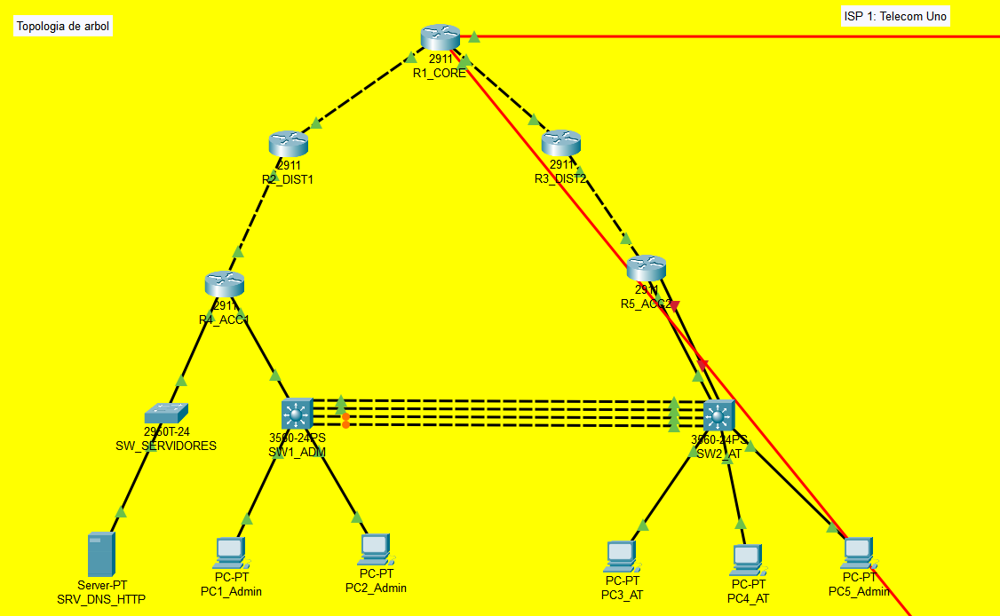
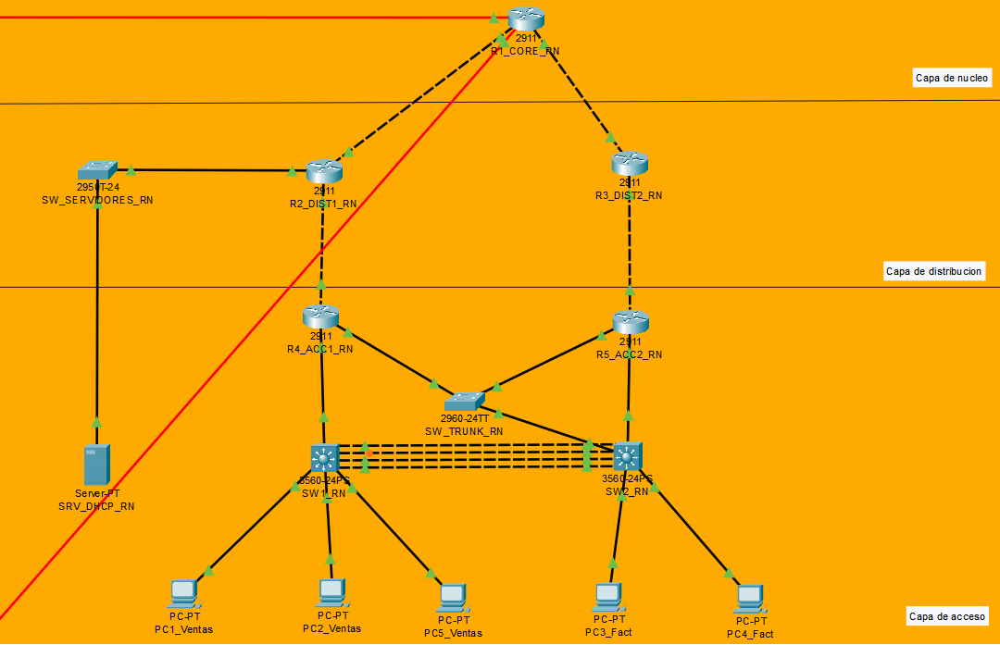
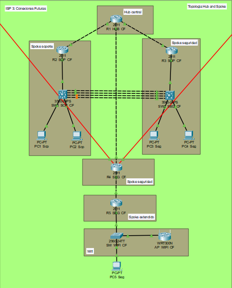
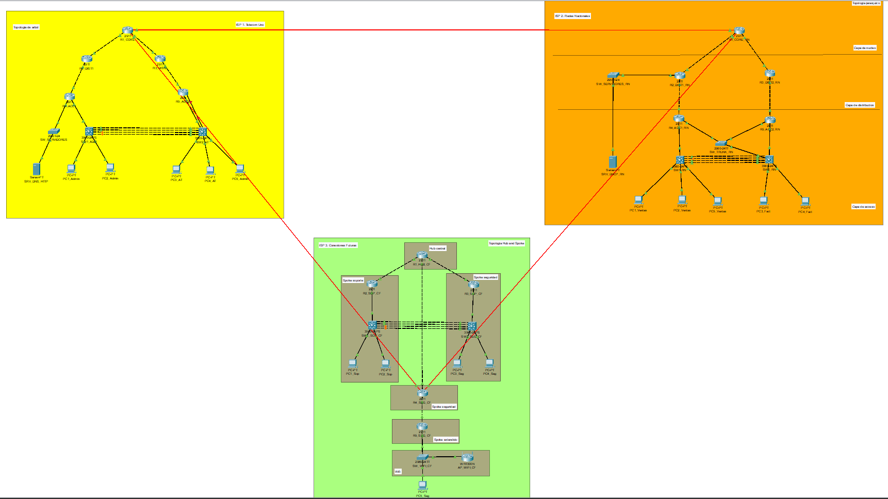

# MANUAL TÉCNICO - PROYECTO 2
## Infraestructura Nacional de Telecomunicaciones

**Estudiante:** Diego Aldair Sajche Avila
**Carné:** 201904490  
**Curso:** Redes de Computadoras 2  
**Fecha:** 01/05/2026

---

## 1. INTRODUCCIÓN

Este documento describe la implementación de una infraestructura nacional de telecomunicaciones que interconecta tres proveedores de servicio (ISP): **Telecom Uno**, **Redes Nacionales** y **Conexiones Futuras**. Cada ISP cumple requisitos específicos de topología, protocolos de enrutamiento interno y servicios críticos.

---

## 2. DIRECCIONAMIENTO IP

### 2.1. Interconexión BGP
Red base: **192.168.90.0/24**

| Enlace | Router A | IP A | Router B | IP B | Red |
|--------|----------|------|----------|------|-----|
| TU ↔ RN | R1_CORE_TU | 192.168.90.1/30 | R1_CORE_RN | 192.168.90.2/30 | 192.168.90.0/30 |
| RN ↔ CF | R1_CORE_RN | 192.168.90.5/30 | R4_SEG_CF | 192.168.90.6/30 | 192.168.90.4/30 |
| CF ↔ TU | R4_SEG_CF | 192.168.90.9/30 | R1_CORE_TU | 192.168.90.10/30 | 192.168.90.8/30 |

### 2.2. Telecom Uno (AS 100)
Red base: **172.16.10.0/24**

| Subred | Uso | Dirección | Gateway |
|--------|-----|-----------|---------|
| /26 | Administración | 172.16.10.0 | 172.16.10.1 |
| /26 | Atención al Cliente | 172.16.10.64 | 172.16.10.65 |
| /26 | Enlaces Punto a Punto | 172.16.10.128 | - |
| /26 | Servidores | 172.16.10.192 | 172.16.10.193 |

Enlaces punto a punto:
- R1↔R2: 172.16.10.128/30
- R1↔R3: 172.16.10.132/30
- R2↔R4: 172.16.10.136/30
- R3↔R5: 172.16.10.140/30
- R4↔SW1: 172.16.10.144/30
- R5↔SW2: 172.16.10.148/30

### 2.3. Redes Nacionales (AS 200)
Red base: **172.16.20.0/24**

| Subred | Uso | Dirección | Gateway HSRP |
|--------|-----|-----------|---------------|
| /26 | Ventas | 172.16.20.0 | 172.16.20.3 |
| /26 | Facturación | 172.16.20.64 | 172.16.20.67 |
| /26 | Enlaces Punto a Punto | 172.16.20.128 | - |
| /26 | DHCP/Servidores | 172.16.20.192 | 172.16.20.193 |

Enlaces punto a punto:
- R1↔R2: 172.16.20.128/30
- R1↔R3: 172.16.20.132/30
- R2↔R4: 172.16.20.136/30
- R3↔R5: 172.16.20.140/30

HSRP:
- Vlan10 (Ventas): Virtual 172.16.20.3, R4 priority 110, R5 priority 100
- Vlan20 (Facturación): Virtual 172.16.20.67, R4 priority 110, R5 priority 100

### 2.4. Conexiones Futuras (AS 300)
Red base: **172.16.32.0/24**

| Subred | Uso | Dirección | Gateway |
|--------|-----|-----------|---------|
| /26 | Soporte | 172.16.32.0 | 172.16.32.1 |
| /26 | Seguridad | 172.16.32.64 | 172.16.32.65 |
| /26 | Enlaces Punto a Punto | 172.16.32.128 | - |
| /26 | WiFi | 172.16.32.192 | 172.16.32.193 |

Enlaces punto a punto:
- R1↔R2: 172.16.32.128/30
- R1↔R3: 172.16.32.132/30
- R1↔R4: 172.16.32.136/30
- R4↔R5: 172.16.32.140/30

---

## 3. TOPOLOGÍAS

### 3.1. Telecom Uno - Topología en Árbol

### 3.2. Redes Nacionales - Topología Jerárquica

### 3.3. Conexiones Futuras - Hub and Spoke

### 3.4. Interconexión BGP (Triángulo)

---

## 4. PROTOCOLOS DE ENRUTAMIENTO

### 4.1. Protocolos Internos

| ISP | Protocolo | AS |
|-----|-----------|-----|
| Telecom Uno | OSPF (Area 0) | - |
| Redes Nacionales | OSPF (Area 0) | - |
| Conexiones Futuras | EIGRP (AS 100) | - |

### 4.2. Protocolo de Interconexión

| Protocolo | AS |
|-----------|-----|
| BGP | 100 (Telecom Uno) |
| BGP | 200 (Redes Nacionales) |
| BGP | 300 (Conexiones Futuras) |

### 4.3. Redistribución
- En routers frontera: redistribución mutua entre BGP y protocolo IGP (OSPF/EIGRP)
- next-hop-self configurado para alcanzabilidad de rutas

---

## 5. SERVICIOS

### 5.1. DNS y HTTP (Telecom Uno)
- Servidor: SRV_DNS_HTTP (172.16.10.200)
- Dominio: www.proyecto2_201904490.com

### 5.2. DHCP (Redes Nacionales)
- Servidor: SRV_DHCP_RN (172.16.20.194)
- Pools configurados para los 3 ISPs
- DHCP relay en switches de capa 3

### 5.3. HSRP (Redes Nacionales)
- Grupo 1 (Ventas): Virtual 172.16.20.3
- Grupo 2 (Facturación): Virtual 172.16.20.67
- R4 activo (priority 110), R5 standby (priority 100)

### 5.4. WiFi (Conexiones Futuras)
- AP: AP_WIFI_CF (WRT300N)
- SSID: ConexionesFuturas_CF
- Seguridad: WPA2 Personal

---

## 6. LACP / ETHERCHANNEL

### 6.1. Telecom Uno
| Grupo | Puertos | Switches |
|-------|---------|----------|
| Po1 | Fa0/23-24 | SW1_ADM_TU ↔ SW2_AT_TU |
| Po2 | Fa0/21-22 | SW1_ADM_TU ↔ SW2_AT_TU |

### 6.2. Redes Nacionales
| Grupo | Puertos | Switches |
|-------|---------|----------|
| Po1 | Fa0/23-24 | SW1_RN ↔ SW2_RN |
| Po2 | Fa0/21-22 | SW1_RN ↔ SW2_RN |

### 6.3. Conexiones Futuras
| Grupo | Puertos | Switches |
|-------|---------|----------|
| Po1 | Fa0/23-24 | SW1_SOP_CF ↔ SW2_SEG_CF |
| Po2 | Fa0/21-22 | SW1_SOP_CF ↔ SW2_SEG_CF |

---

## 7. REGLAS DE COMUNICACIÓN (ACLs)

| Departamento | Tráfico Salida | Tráfico Entrada |
|-------------|----------------|-----------------|
| Seguridad | Todos | Ninguno |
| Soporte | Todos | Todos |
| Administración | Todos | Todos |
| Atención al Cliente | Ventas | Ventas |
| Facturación | Ventas | Ventas |
| Ventas | Facturación y Atención | Facturación y Atención |

Implementadas mediante ACLs en las interfaces VLAN de cada switch de acceso.

---

## 8. DISPOSITIVOS UTILIZADOS

| Dispositivo | Cantidad | Modelo |
|-------------|----------|--------|
| Routers | 15 | Cisco 2911 |
| Switches Multicapa | 6 | Cisco 3560-24PS |
| Switches Capa 2 | 3 | Cisco 2960-24TT |
| Access Point | 1 | WRT300N |
| PCs | 15 | PC-PT |
| Servidores | 2 | Server-PT |

---

## 9. MEDIOS DE CONEXIÓN

| Conexión | Medio |
|----------|-------|
| Router ↔ Router | Fibra Óptica |
| Interconexión BGP | Fibra Óptica |
| Router ↔ Switch | Cobre Directo |
| Switch ↔ Host | Cobre Directo |

---

## 10. COSTOS ESTIMADOS

| Dispositivo | Precio Unitario | Cantidad | Subtotal |
|-------------|-----------------|----------|----------|
| Cisco 2911 | $1,500 | 15 | $22,500 |
| Cisco 3560-24PS | $2,000 | 6 | $12,000 |
| Cisco 2960-24TT | $500 | 3 | $1,500 |
| WRT300N | $100 | 1 | $100 |
| Servidores | $2,000 | 2 | $4,000 |
| Fibra Óptica (metros) | $10 | 100 | $1,000 |
| **TOTAL** | | | **$41,100** |

---

## 11. VERIFICACIÓN DE CONECTIVIDAD

### 11.1. Pruebas Internas
- Ping entre departamentos del mismo ISP: ok
- Ping a gateways: ok
- HSRP failover: ok (R4 activo, R5 standby; al desconectar R4, R5 toma el rol activo)

### 11.2. Pruebas Inter-ISP
| Origen | Destino | Resultado |
|--------|---------|-----------|
| PC1_Admin (TU) | PC Ventas (RN) | ok |
| PC1_Admin (TU) | PC5_Seg (CF) | ok |
| PC Ventas (RN) | PC1_Admin (TU) | ok |
| PC Ventas (RN) | PC5_Seg (CF) | ok |
| PC5_Seg (CF) | PC1_Admin (TU) | ok |
| PC5_Seg (CF) | PC Ventas (RN) | ok |

### 11.3. Pruebas ACLs
- Atención al Cliente → Ventas: Permitido
- Atención al Cliente → Administración: Denegado
- Atención al Cliente → Seguridad: Denegado
- Facturación → Ventas: Permitido 
- Facturación → Otros: Denegado
- Seguridad → Todos (entrada): Denegado

---

## 12. CONCLUSIONES

1. La infraestructura implementada cumple con todos los requisitos del enunciado
2. La topología en árbol, jerárquica y hub-and-spoke proveen redundancia y escalabilidad
3. BGP permite la interconexión eficiente entre los 3 ISPs
4. HSRP garantiza alta disponibilidad en Redes Nacionales
5. Las ACLs implementan correctamente las políticas de seguridad requeridas
6. Los servicios DNS, HTTP y DHCP están configurados y funcionales